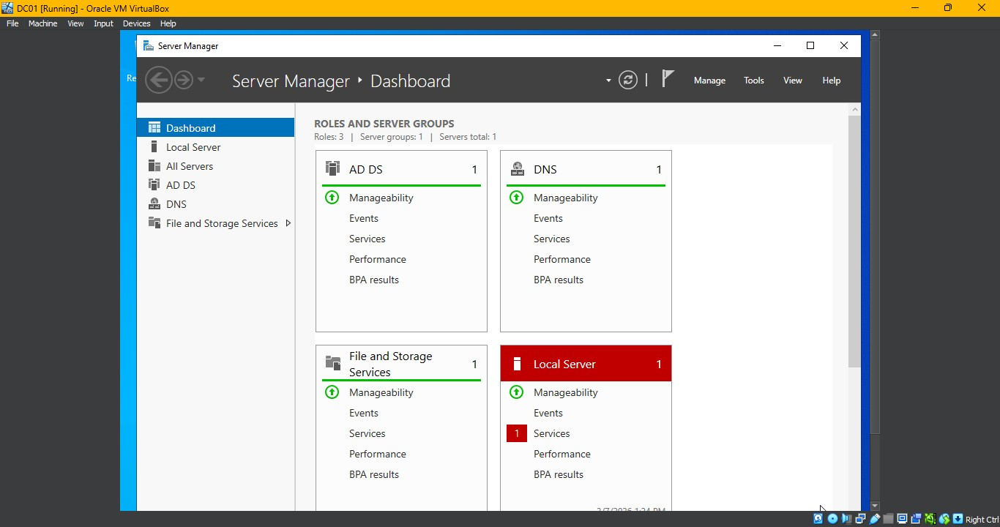
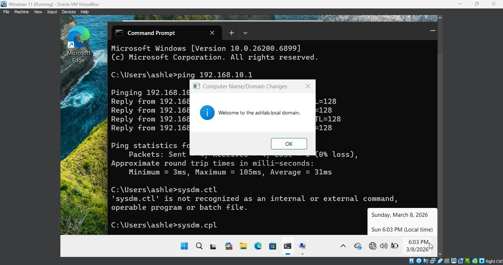
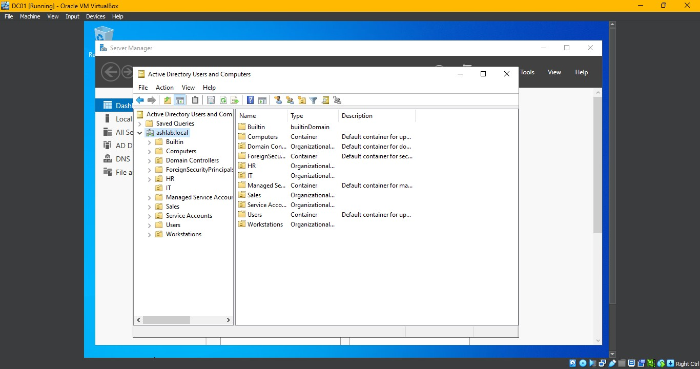
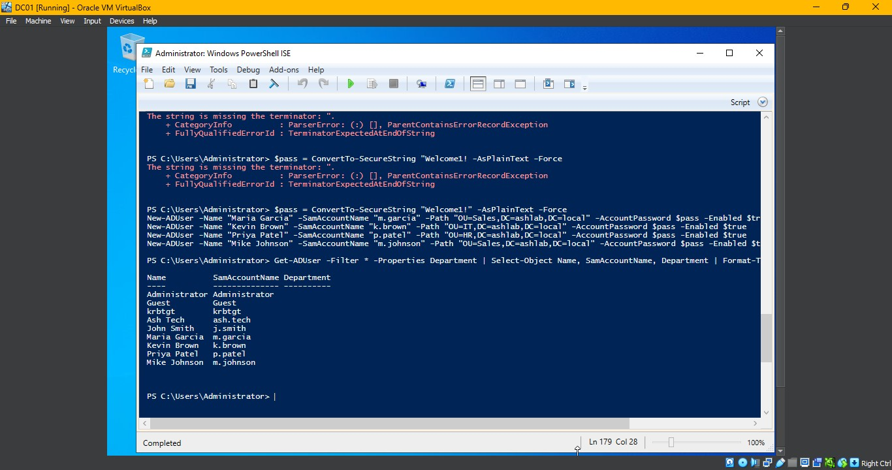
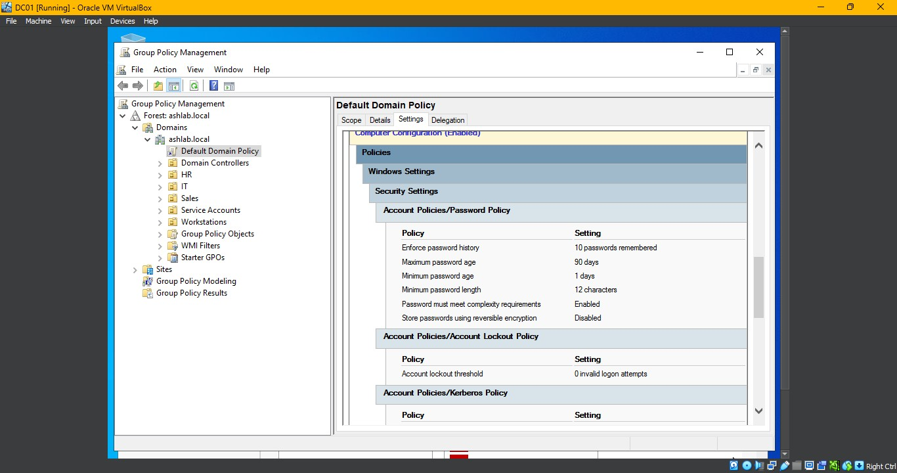
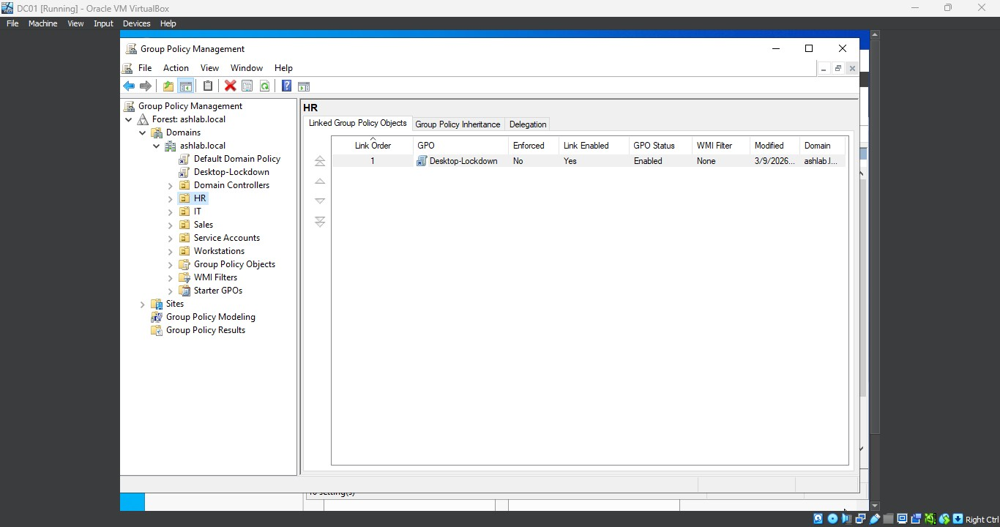
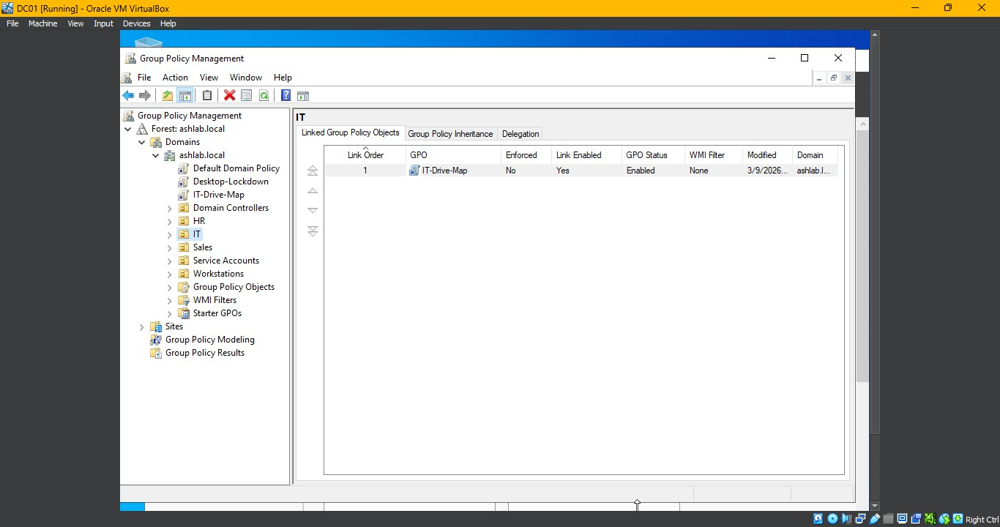
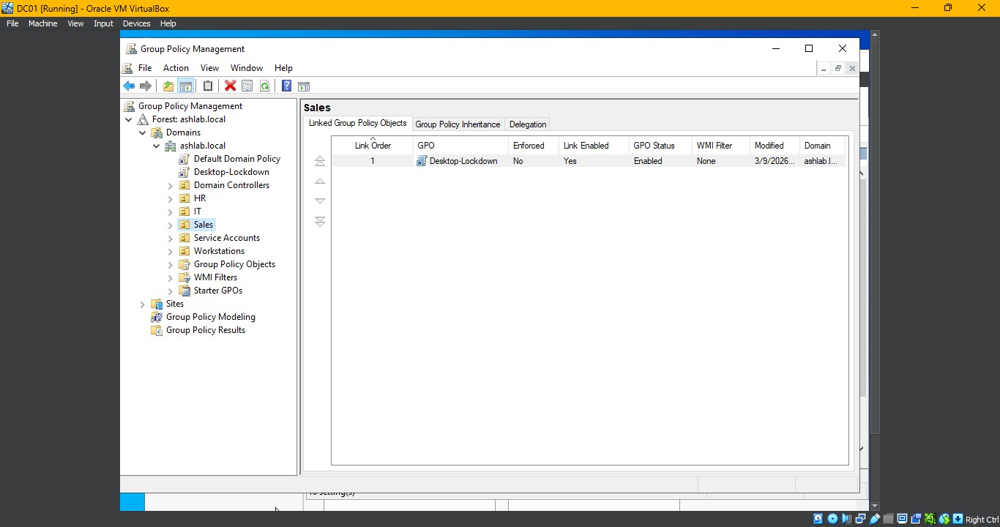
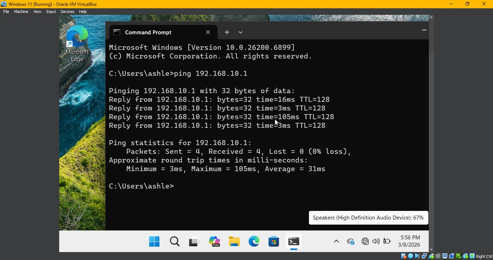
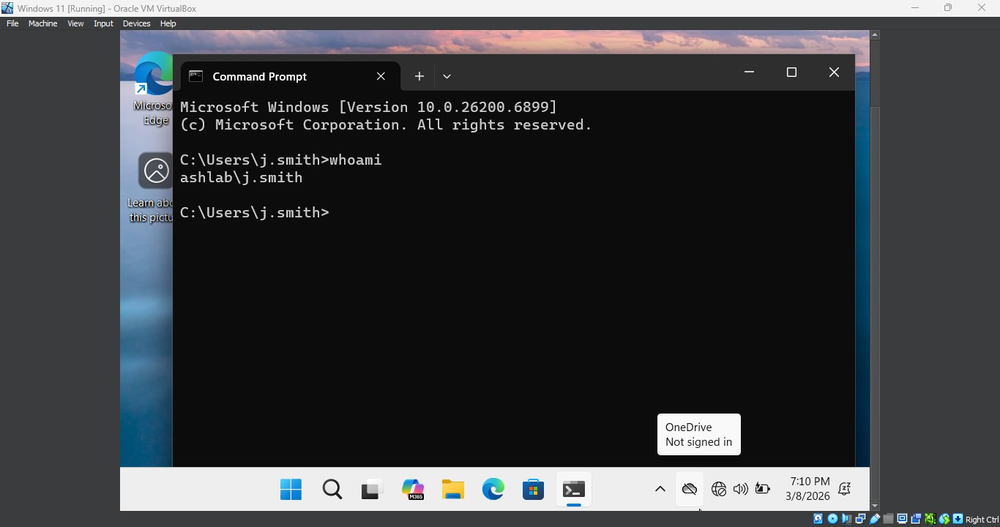

# 🖥️ Active Directory Home Lab

A fully functional on-premises Active Directory environment built in VirtualBox to simulate real-world enterprise IT administration. This lab demonstrates core skills required for Level 2 Help Desk and junior sysadmin roles.

---

## 🧰 Tools & Technologies

| Tool | Purpose |
|---|---|
| Oracle VirtualBox | Hypervisor / VM environment |
| Windows Server 2022 (Eval) | Domain Controller (DC01) |
| Windows 11 Enterprise (Eval) | Domain-joined workstation (WS01) |
| PowerShell ISE | Scripting & automation |
| Active Directory Users & Computers | User/OU/Group management |
| Group Policy Management Console | GPO configuration |

---

## 🏗️ Lab Architecture

```
ashlab.local (Domain)
│
├── DC01 (Windows Server 2022)
│   ├── IP: 192.168.10.1
│   ├── DNS Server
│   └── Active Directory Domain Controller
│
└── WS01 (Windows 11 Enterprise)
    ├── IP: 192.168.10.10
    └── Domain-joined workstation
```

Both VMs are connected via VirtualBox **Internal Network (LabNet)**  isolated from the host network.





---

## ✅ What Was Configured

### Organizational Units (OUs)
Created a structured OU layout to mirror a real business environment:

- `IT` — IT department staff
- `HR` — Human Resources staff
- `Sales` — Sales department staff
- `Workstations` — Domain-joined computers
- `Service Accounts` — Service/application accounts

### Security Groups
| Group | OU | Type |
|---|---|---|
| IT-Admins | IT | Global Security |
| HR-Staff | HR | Global Security |
| Sales-Staff | Sales | Global Security |

### User Accounts
Manually created one user and bulk-created 5 additional users via PowerShell CSV import:

| Name | Username | Department |
|---|---|---|
| Ash Tech | ash.tech | IT |
| John Smith | j.smith | HR |
| Maria Garcia | m.garcia | Sales |
| Kevin Brown | k.brown | IT |
| Priya Patel | p.patel | HR |
| Mike Johnson | m.johnson | Sales |



---

## 💻 PowerShell Automation

### Bulk User Creation from CSV
Users are provisioned automatically from a CSV file using the script in `/scripts/bulk-create-users.ps1`.

**CSV format (`users.csv`):**
```csv
FirstName,LastName,Username,Department,OU
John,Smith,j.smith,HR,HR
Maria,Garcia,m.garcia,Sales,Sales
Kevin,Brown,k.brown,IT,IT
```

**Script places each user in the correct OU, sets a default password, and enables the account.**



---

## 🔒 Group Policy Objects (GPOs)

### 1. Password Policy (Default Domain Policy)
Applied domain-wide to enforce password security standards.

| Setting | Value |
|---|---|
| Minimum password length | 12 characters |
| Password complexity | Enabled |
| Maximum password age | 90 days |
| Enforce password history | 10 passwords remembered |



### 2. Desktop Lockdown
Applied to `HR` and `Sales` OUs to restrict end-user configuration.

- Prevent changing desktop background
- Prevent access to Command Prompt







### 3. Drive Mapping (IT Admins)
Applied to `IT` OU with item-level targeting scoped to the `IT-Admins` security group.

- Maps `\\DC01\IT-Share` as drive **Z:** on login
- Only applies to members of IT-Admins group

---

## 🖧 Domain Join

Successfully joined WS01 (Windows 11) to `ashlab.local`:
- Configured DNS to point to DC01 (`192.168.10.1`)
- Joined domain via System Properties
- Verified domain user login with GPO application





---

## 📁 Repository Structure

```
active-directory-home-lab/
├── README.md
├── scripts/
│   └── bulk-create-users.ps1
├── gpo-docs/
│   ├── password-policy.md
│   ├── desktop-lockdown.md
│   └── drive-mapping.md
└── screenshots/
    ├── 01-server-manager-dashboard.jpg
    ├── 02-ashlab-local-domain-created.jpg
    ├── 03-domain-connectivity-ping-test.jpg
    ├── 04-bulk-users-created-powershell.jpg
    ├── 05-active-directory-users-computers.jpg
    ├── 06-gpo-password-policy.jpg
    ├── 07-gpo-linked-hr-ou.jpg
    ├── 08-gpo-linked-it-ou.jpg
    ├── 09-gpo-linked-sales-ou.jpg
    └── 10-domain-user-login-verified.jpg
```

---

## 🎯 Skills Demonstrated

- Active Directory installation and domain controller promotion
- OU and security group design for a multi-department organization
- PowerShell scripting for automated user provisioning
- Group Policy creation, linking, and item-level targeting
- Windows Server administration and network configuration
- Domain join procedure and DNS configuration

---

## 📌 Notes

- Windows Server 2022 and Windows 11 Enterprise evaluation ISOs are free from Microsoft's Eval Center (180-day license)
- VirtualBox Internal Network keeps the lab fully isolated from your home/office network
- Default passwords used in this lab are for demonstration only — production environments require stronger credential management practices

---

*Built as part of an IT portfolio to demonstrate hands-on Active Directory administration skills.*
